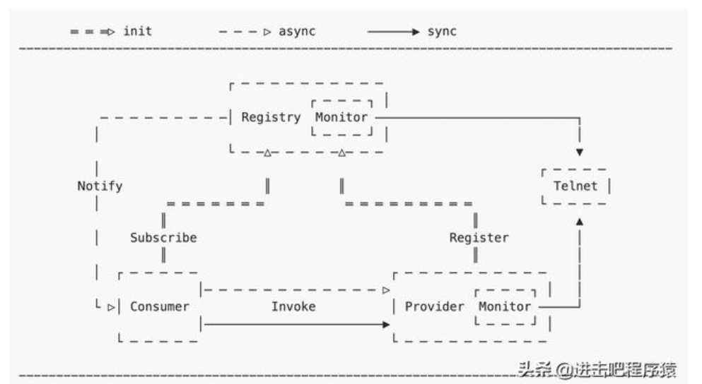
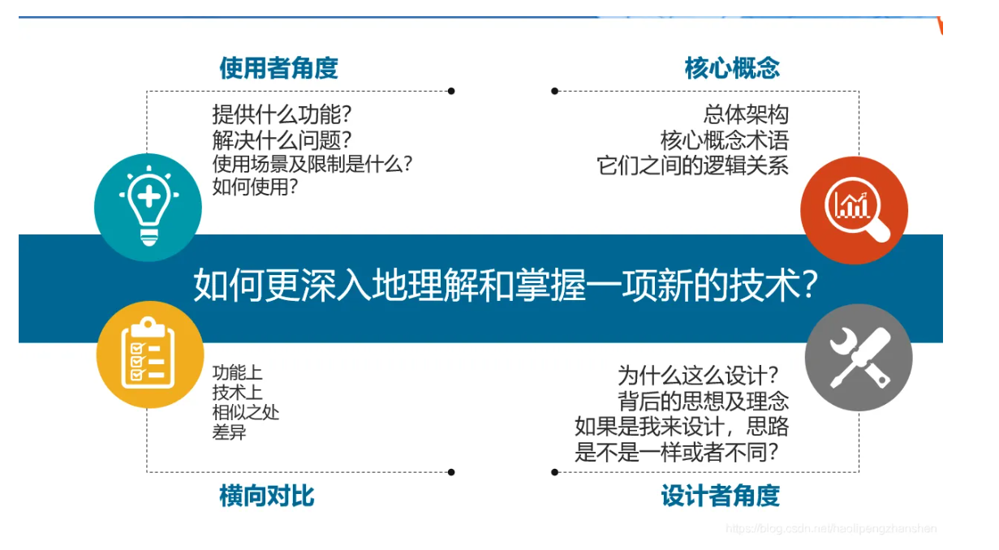

**如何阅读优秀源代码**


书到用时方恨少。看看chatGPT老师版的中国老话吧。

记录这篇博客是因为我需要学习CyberRT的协程模型，需要去学习其源代码，这是我第一次相对深入的学习开源代码，这是一个机会，学习如何去学习优秀的开源代码，所以先有这篇博客。

这篇博客整理自以下的优秀博客：

```http
http://www.360doc.com/content/21/0222/23/44130189_963437848.shtml
https://zhuanlan.zhihu.com/p/350184891
https://zhuanlan.zhihu.com/p/501824814
https://blog.csdn.net/qq_45893475/article/details/118771350
```

# 为什么要阅读源代码


阅读源代码的能力算是程序员的一种底层基础能力之一，这个能力之所以重要，原因在于：

- 不可避免的需要阅读或者接手他人的项目。比如调研一个开源项目，比如接手一个其他人的项目。
- 阅读优秀的项目源码是学习他人优秀经验的重要途径之一。
  读代码与写代码是两个不太一样的技能，原因在于“写代码是在表达自己,读代码是在理解别人”。因为面对的项目多，项目的作者有各自的风格，理解起来需要花费不少的精力。
- 学习大师的思想。我一直认为思想都无法蔓延到的边界，又怎能脚踏实地的去往那样的远方。

怎样做？读源码要着重思考，思考为什么这么设计？可能的原因是什么？然后去验证（先有自己的思考和猜测，但是能做到这一点需要对源码所做的事情和所在的领域有一定的积累和理解）。

千里之行始于足下：

- 学习代码在平时，工作时如果项目开发工期不紧，编码过程中进入源码分析学习，积少成多；
- 在开发过程中，如果遇到问题，可以选择进入源码调试，这样印象更深刻；
- 此外，我们既要埋头苦干也要“仰望星空”（巩固专业基础），有些核心的软件设计原则，操作系统、计算机网络的设计原理，都是源码设计思想的重要来源，如果专业基础不扎实，往往很难了解问题的本质。

# 阅读源码

做事要“以终为始”，只有搞清楚读源码我们究竟想得到什么，我们才能避免“走马观花” 最终将收获无多的尴尬场景。

**那么读源码读的是什么？我们要关注哪些方面呢？**

**读目的**：该框架是为了解决什么问题？比同类框架相比的优劣是什么？这对理解框架非常重要。

**读注释：**很多人读源码会忽略注释。建议大家读源码时一定要重视注释。因为优秀的开源项目，通常某个类、某个函数的目的、核心逻辑、核心参数的解释，异常的发生场景等都会写到注释中，这对我们学习源码，分析问题有极大的帮助。

**读逻辑：**这里所谓的逻辑是指语句或者子函数的顺序问题。我们要重视作者编码的顺序，了解为什么先写 A 再写 B，背后的原因是什么。

**读思想：**所谓思想是指源码背后体现出了哪些设计原则，比如是不是和设计模式的六大原则相符？是不是符合高内聚低耦合？是不是体现某种性能优化思想？

**读原理**：读核心实现步骤，而不是记忆每行代码。核心原理和步骤最重要。

**读编码风格**：一般来说优秀的源码的代码风格都比较优雅。我们可以通过源码来学习编码规范。

**读编程技巧**：作者是否采用了某种设计模式，某种编程技巧实现了意料之外的效果。

**读设计方案**：读源码不仅包含具体的代码，更重要的是设计方案。比如我们下载一个秒杀系统 / 商城系统的代码，我们可以学习密码加密的方案，学习分布式事务处理的方案，学习幂等的设计方案，超卖问题的解决方案等。因为掌握这些方案之后对提升我们自己的工作经验非常有帮助，我们工作中做技术方案时可以参考这些优秀项目的方案。

## 对着答案做题

我们知道很多小学生、初高中生，甚至很多大学生学习会出现眼高手低的情况。

有些人做题时并不是先思考，而是先看答案，然后对着答案的思路来理解题目。在这种模式下，大多数题目都理所当然地这么做，会误认为自己真正懂了。但是即使是原题，也会做错，想不出思路。

**同样地，很多人读源码也会走到这个误区中。直接看源码的解析，直接看源码的写法，缺乏关键的前置步骤，即先自己思考再对照源码。**

## 明确目的

在开始阅读代码之前，首先要明确自己的阅读目的：

是需要了解其中一个模块的实现？比如基础模块还是业务模块？基础模块中有内存池、线程池、网络数据收发epoll模型等，

还是需要了解这个框架的大体结构，

还是需要具体熟悉其中的一个算法的实现，等等。

心里很清楚自己想要什么，才能更有动力去朝着目标努力奋斗。

## 先主线后支线

这里的分支指的是功能或版本：

**从功能上说：**

比如你对网络通讯感兴趣，就阅读网络层的代码，深入到实现细节：

如它用了什么库，

采用了什么设计模式，

为什么这样做等。

如果可以，debug细节代码。

**从源代码版本上说：**

不一定选择最新版本的开源代码进行阅读，如果感觉有点吃力，可选用同一个开源项目的老版本（如1.0版本），

此时的项目代码，不管是代码量还是复杂度上都要小很多，看起来要容易的多。

## 先整体后局部

先整体后局部是非常重要的一个认知规则，体现了“整体思维”。

如果对框架缺乏整体认识，很容易陷入局部细节之中。

先整体后局部包括多种含义，下面会介绍几种核心的含义。

### 先看架构再读源码

**大家可以通过框架的官方文档了解其整体架构，了解其核心原理，然后再去看具体的源代码。**

但是很多人总会忽视这个步骤。

如轻量级分布式服务框架 jupiter 框架 的 README.md 给出了框架的整体架构：



（图片来自：jupiter 项目 README.md 文档）

对框架有了一个整体了解之后，再去看具体的实现就会容易很多。

### 先看项目结构再读源码

先整体后局部，还包括**先看项目的分包，再具体看源码**。

通过项目的报名，如 monitor、registry、serialization、example、common 等就可以明白该包下的代码意图。

### 先看类的函数列表再读源码

通过 IDEA 的函数列表功能，可以快速了解某个类包含的函数，可以对这个类的核心功能有一个初步的认识。

这种方式在读某些源码时效果非常棒。

更重要的是，如果能够养成查看函数列表的习惯，可以发现很多重要但是被忽略的函数，在未来的项目开发中很可能会用到。

### 先看整体逻辑再看某个步骤

比如一个大函数可能分为多个步骤，我们先要理解某个步骤的意图，了解为什么先执行子函数 1, 再执行子函数 2 等。

然后再去观察某个子函数的细节。

## 理清核心数据结构

程序设计 = 数据结构 + 算法

因为结构定义了一个程序的架构，结构定下来了才有具体的实现。好比盖房子，数据结构就是房子的框架结构，如果一间房子很大，而你并不清楚这个房子的结构，会在这里面迷路。

而对于算法，如果属于暂时不需要深究的细节部分，可以参考前面“区分主线和支线剧情”部分，先了解其入口、出口参数以及作用即可。

Linus说： “烂程序员关心的是代码。好程序员关心的是数据结构和它们之间的关系。”

因此，在阅读一份代码时，厘清核心的数据结构之间的关系尤其重要。

## 添加日志 and 单步调试（情景分析）

看文档或看代码的过程中，对一些技术点，是需要验证的。

所谓的“情景分析”，就是自己构造一些情景，然后通过加断点、调试语句等分析在这些场景下的行为。

我惯用的做法，是在某个重要的入口函数上面加上断点，然后构造触发场景的调试代码，当代码在断点处停下，通过查看堆栈、变量值等等来观察代码的行为。

情景分析的好处在于：不会在一个项目中大海捞针似的查找，而是能够把问题缩小到一个范围内展开来理解。

从而把个人的时间和精力聚焦到一个小的范围内不断的研究，一直研究到自己满意为止。

修改源码加入日志和打印可以帮助你更好的理解源码。

gdb单步调试，一步步跟踪，是了解源代码最好的途径，没有之一。

## 画图梳理源代码逻辑

适当画图来帮助你理解源码，在理清主干后，可以将整个流程画成一张流程图或者标准的UML图，帮助记忆和下一步的阅读。

画图虽然很浪费时间，但是对帮助理解架构和流程很有帮助。

## 解决遇到的问题

相信经过前面三个阶段，你已经是各种玩，各种瞎折腾，心里还是有很多疑问吧？

这个功能真牛逼，是如何实现的呢？

我的配置文件为什么没有生效呢？

程序为什么被我搞挂了呢？

我添加的打印为什么没有被执行？

打印的值为什么不符合我的预期？

好！很好！带着这些你心里的问题，去源代码中找答案吧

**1.先总体后局部，把握好主体逻辑代码，然后再逐层深入下去**

一上来就陷入太多的实现细节是大忌！！！

熟悉主体逻辑后，你大概能知道你感兴趣的代码处于整个项目中的什么模块，什么文件，什么类中

是个什么样的处理流程，定位到具体代码，一行行的分析它，这个过程会持续一段时间。

**2.带着问题去看代码**

一个系统实现了什么功能，为什么要实现这些功能，是基于什么业务场景？

**3.思考自己如何实现类似系统（功能）**

如果要我来实现一套类似的系统，我会如何来考虑问题，如何来实现这套系统?

然后再看看别人是如何实现的，找到两者之间的差距，并不断缩小之间的差距。




上图是总结的学习方法论，

**核心概念：**

总体架构

核心概念和术语

逻辑关系如何

**从使用者的角度来看：**

1、提供什么功能？

2、解决什么问题？

3、使用场景和限制是什么

4、如何来使用

**横向对比：**

功能上相似之处和差异

技术实现原理上相似之处和差异

**从设计者角度：**

1、为什么这么设计？

2、背后的思想和理论

3、如果我来设计，会从哪些方面来考虑？

# 从设计者的角度学源码

从设计者的角度读源码是一条极其重要的思想。体现了**“先猜想后验证”**的思想。

这样就可以走出“对着答案做题”的误区。

学习源码时不管是框架的整体架构、某个具体的类还是某个函数都要设想如果自己是作者，该怎么设计框架、如何编写某个类、某个函数的代码。

然后再和最终的源码进行对比，发现自己的设想和对方的差异，这样对源码的印象更加深刻，对作者的意图领会的会更加到位。

# 从设计模式的角度学源码

很多优秀的开源项目都会用到各种设计模式，尤其是学习 Spring 源码。

因此，强烈建议要了解常见的设计模式。

了解常见设计模式的目的、核心场景、优势和劣势等。

要理解**设计模式的六大原则**：单一职责原则、开闭原则、依赖倒置原则、接口隔离原则、迪米特法则等。

在读源码时注意体会设计模式的六大原则在源码中的体现。

# 读源码的粒度问题

很多开源项目代码行数非常多，几十万甚至上百万行，想都读完并且都能记下来不太现实。

前面也讲到读源码读什么的问题，个人建议大家读核心的原理，关键特性的实现，高抽象层的几个关键步骤。

不要追求读每一行代码，甚至“背诵”代码，因为工作之后学习的目的更多地是为了运用，而不是为了考试。

# 写笔记记录想法，促进思考和总结

1.**记录解开问题谜团的过程**

2.记录下开源代码中好的设计思想，好的代码技巧，以及任何你觉得好的东西

3.画整个程序的流程图，有利于理解程序的整个流程，而不被代码的细节所干扰。

4.坚持记录源代码学习笔记，记笔记能够有助于更深入的思考，以前很多问题只是浅层思考，不够深入

## 抄写项目源代码

以groupcache来举例，它包括lru，singleflight，protobuf，一致性hash这四个技术

步骤一：抄写前，可以大致了解下这些技术，比如lru是什么？lru解决什么问题？简单了解下lru的实现原理（后续深入具体实现）

步骤二：抄写过程中，会发现和之前了解的实现原理有不同的地方，比如有优化，或者有疑惑点，记录下来，继续抄写。

步骤三：抄写后，针对有疑惑的点，找资料，找人交流，必须搞清楚前面记录的不动的地方。

## 仿写项目

如果感觉自己对于项目理解的还不到位，我推荐一个笨方法，抄项目代码，抄着抄着你就懂了。

如果想进一步深刻的学习到源代码的精髓，可以仿写一个相近的程序进行操练。

理解了这个程序并不表明掌握了这个程序，只有在操练一个相近的程序时，才知道你到底理解了多少，掌握了多少

## 教给他人（输出知识）

检验是否掌握一门技术，就是将知识输出，看他人能否听懂

当自己对项目的方方面面都很熟悉后，可以在B站上开直播，将自己所学的知识传授给他人。

输出形式：

1、csdn博客、知乎、头条、微信公众号等平台发文章

2、组内技术讨论或者微信群讨论

3、公司内技术分享会（正式）

3、在B站上直播，将自己辛辛苦苦学到的知识分享出去