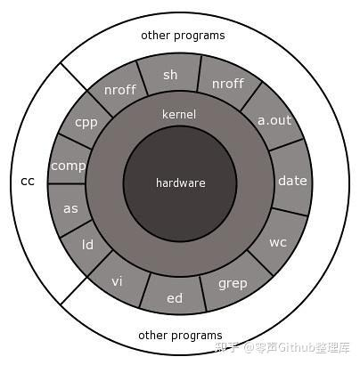

**coroutine**

协程学习

这个仓库记录了自己学习协程的过程，包含一些理论和实践，大部分资料来源网上开源的资料和博客。

目前包含三个部分：

- 有栈协程的原理和实现
- 无栈协程的原理和实现
- CyberRT协程模型源码分析

## **基础知识**

在学习协程之前，我们需要了解一些基本的知识，帮助我们理解协程。

### **应用程序和内核**

内核具有最高权限，可以访问受保护的内存空间，可以访问底层的硬件设备。而这些是应用程序所不具备的，但应用程序可以通过调用内核提供的接口来间接访问或操作。以一次网络 IO 请求过程中的 read 操作为例，请求数据会先拷贝到系统内核的缓冲区（内核空间），再从操作系统的内核缓冲区拷贝到应用程序的地址空间（用户空间）。而从内核空间将数据拷贝到用户空间过程中，就会经历两个阶段：

- 等待数据准备
- 拷贝数据

也正因为有了这两个阶段，才提出了各种网络 IO 模型。

### **同步和异步**

同步（Synchronised）和异步（Asynchronized）的概念描述的是应用程序与内核的交互方式，同步是指应用程序发起 IO 请求后需要等待或者轮询内核 IO 操作返回结果后才能继续执行；而异步是指应用程序发起 IO 请求后仍继续执行，当内核 IO 操作完成后会通知应用程序，或者调用应用程序的回调函数。同步和异步是相对于操作结果来说，会不会等待结果返回。

### **阻塞和非阻塞**

阻塞和非阻塞的概念描述的是应用程序调用内核 IO 操作的方式，阻塞是指 IO 操作需要彻底完成后才返回到用户空间；而非阻塞是指 IO 操作被调用后立即返回给用户一个状态值，无需等到 IO 操作彻底完成。

### **并发**

在操作系统中，并发是指 一个时间段 中有几个程序都处于已启动运行到运行完毕之间，且这几个程序都是在同一个处理机上运行，但任一个时刻点上只有一个程序在处理机上运行。

并发和并行的区别：

- 并发（concurrency）：逻辑上具备同时处理多个任务的能力。
- 并行（parallesim）：物理上在同一时刻执行多个并发任务，依赖多核处理器等物理设备。

## **协程的基本概念**

我们可以看一下维基百科中对协程的定义：

> Coroutines are computer program components that generalize subroutines for non-preemptive multitasking, by allowing multiple entry points for suspending and resuming execution at certain locations. Coroutines are well-suited for implementing more familiar program components such as cooperative tasks, exceptions, event loops, iterators, infinite lists and pipes.

协程是一种程序组件，是由子例程（过程、函数、例程、方法、子程序）的概念泛化而来的，子例程只有一个入口点且只返回一次，而协程允许多个入口点，可以在指定位置挂起和恢复执行。

简而言之，协程在行为逻辑上和线程、进程类似，都是实现不同逻辑流的切换和调度。但要明确的是，**协程(Coroutine)编译器级的，进程(Process)和线程(Thread)操作系统级的。**

### **引入协程的目的**

在没有协程的时代，为了应对 IO 操作，主要有三种模型

- 同步编程：应用程序等待IO结果（比如等待打开一个大的文件，或者等待远端服务器的响应），阻塞当前线程；
- 优点：符合常规思维，易于理解，逻辑简单；
- 缺点：成本高昂，效率太低，其他与IO无关的业务也要等待IO的响应；
- 异步多线程/进程：将IO操作频繁的逻辑、或者单纯的IO操作独立到一/多个线程中，业务线程与IO线程间靠通信/全局变量来共享数据；
- 优点：充分利用CPU资源，防止阻塞资源
- 缺点：线程切换代价相对较高，异步逻辑代码复杂
- 异步消息+回调函数：设计一个消息循环处理器，接收外部消息（包括系统通知和网络报文等），收到消息时调用注册的回调函数；
- 优点：充分利用CPU资源，防止阻塞资源
- 缺点：代码逻辑复杂

协程的概念，从一定程度来讲，可以说是**“用同步的语义解决异步问题”**，即业务逻辑看起来是同步的，但实际上并不阻塞当前线程（一般是靠事件循环处理来分发消息）。协程就是用来解决异步逻辑的编程复杂度问题的。

### **优点**

- 协程更加轻量，创建成本更小，降低了内存消耗
- 协程有自己的调度器，减少了 CPU 上下文切换的开销，提高了 CPU 缓存命中率
- 减少同步加锁，整体上提高了性能
- 可以按照同步思维写异步代码，即用同步的逻辑，写由协程调度的回调

### **缺点**

- 在协程执行中不能有阻塞操作，否则整个线程被阻塞
- 协程可以处理 IO 密集型程序的效率问题，但不适合处理 CPU 密集型问题

### **适用场景**

- 高性能计算，牺牲公平性换取吞吐。
- 在 IO 密集型的热舞
- Generator 式的流式计算

