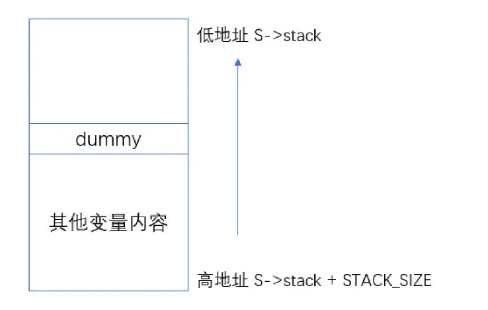

STACKLESS_COROUTINE 无栈协程的原理和实现

# ucontext介绍

> 下面关于 ucontext 的介绍源自：

- [http://pubs.opengroup.org/onli](https://link.zhihu.com/?target=http%3A//pubs.opengroup.org/onlinepubs/7908799/xsh/ucontext.h.html)

实际上，ucontext lib 已经不推荐使用了，但依旧是不错的协程入门资料。其他底层协程库实现可以查看：

- **Boost.Context**
- **tbox**

协程库的对比可以参考：

- [https://github.com/tboox/benchbox/wiki/switch](https://link.zhihu.com/?target=https%3A//github.com/tboox/benchbox/wiki/switch)

linux 系统一般都存在 ucontext 这个 C语言库，这个库主要用于：**操控当前线程下的 CPU 上下文。**

> 需要注意的是：
> ucontext 只操作与当前线程相关的 CPU 上下文，所以下文中涉及 ucontext 的上下文均指当前线程的上下文；（一般CPU 有多个核心，一个线程在某一时刻只能使用其中一个，所以 ucontext 只涉及一个与当前线程相关的 CPU 核心）

`ucontext.h` 头文件中定义了 `ucontext_t` 这个结构体，这个结构体中至少包含以下成员：

```c
ucontext_t *uc_link     // next context
sigset_t    uc_sigmask  // 阻塞信号阻塞
stack_t     uc_stack    // 当前上下文所使用的栈
mcontext_t  uc_mcontext // 实际保存 CPU 上下文的变量，这个变量与平台&机器相关，最好不要访问这个变量
```

> **可移植的程序最好不要读取与修改 ucontext_t 中的 uc_mcontext，因为不同平台下 uc_mcontext 的实现是不同的。**

同时，`ucontext.h` 头文件中定义了四个函数，下面分别介绍：

```c
int  getcontext(ucontext_t *); // 获得当前 CPU 上下文
int  setcontext(const ucontext_t *);// 重置当前 CPU 上下文
void makecontext(ucontext_t *, (void *)(), int, ...); // 修改上下文信息，比如设置栈指针
int  swapcontext(ucontext_t *, const ucontext_t *);
```


下面分别来看。

### **getcontext**

```c
#include <ucontext.h>
int getcontext(uconte t_t *ucp);
```

`getcontext` 函数使用当前 CPU 上下文初始化 ucp 所指向的结构体，初始化的内容包括： CPU 寄存器、信号 mask 和当前线程所使用的栈空间；

**返回值**：**getcontext 成功返回 0，失败返回 -1。**

### **setcontext**

```c
#include <ucontext.h>
int setcontext(ucontext_t *ucp);
```

**和 getcontext 函数类似，setcontext 函数用于：设置CPU 寄存器、信号 mask 和当前线程所使用的栈空间。**

需要特别注意的是：

如果函数 `setcontext` 执行成功，那么调用 `setcontext` 的函数将不会返回，因为当前 CPU 的上下文已经交给其他函数或者过程了，当前函数完全放弃了 对 CPU 的“所有权”。

> getcontext 和 setcontext 的应用：
> **当信号处理函数需要执行的时候，当前线程的上下文需要保存起来，随后进入信号处理阶段；**

### **makecontext**

```c
#include <ucontext.h>
void makecontext(ucontext_t *ucp, (void *func)(), int argc, ...);
```

**makecontext 修改由 getcontext 创建的上下文 ucp；**

如果 `ucp` 指向的上下文由 `swapcontext` 或 `setcontext` 恢复，那么当前线程将执行传递给 `makecontext` 的函数 `func(...)`。

执行 makecontext 后需要为新上下文分配一个栈空间，如果不创建，那么新函数`func`执行时会使用旧上下文的栈，而这个栈可能已经不存在了。同时，argc 必须和 func 中整型参数的个数相等。

### **swapcontext**

```c
#include <ucontext.h>
int swapcontext(ucontext_t *oucp, const ucontext_t *ucp);
```

**swapcontext 将当前上下文信息保存到 oucp 中并使用 ucp 重置 CPU 上下文。**

**返回值**：

- 成功则返回 0；
- 失败返回 -1 并置 `errno`；

**如果 ucp 所指向的上下文没有足够的栈空间以执行余下的过程，swapcontext 将返回 -1。**

### **总结**

使用 `ucontext` 我们可以方便的获取当前调用函数的上下文，进而实现协程！


# 实现

## 基于ucontext实现的无栈协程

前面使用汇编实现了有栈协程，相应的使用ucontext库来实现无栈协程

```http
参考代码 https://link.zhihu.com/?target=https%3A//github.com/JasonkayZK/cpp-learn/tree/coroutine/stackless_co
```

## 协程调用函数的定义

为了简单起见，我们这里定义的协程可以调用的函数签名为：

**stackless_co/utils.h**

```c++
typedef void (*coroutine_func)(Schedule *, void *ud);
```

在调用时，可以传入一个 arg 结构体，来使用；

例如：

```c++
struct args {
    int n;
};
```

作为参数 `*ud`；

**同时，考虑到参数的通用性，这里使用了 void\* 作为入参和返回值；**

## 协程实例

协程的定义如下：

**stackless_co/coroutine.h**

```C++
#ifndef COROUTINE_COROUTINE_H
#define COROUTINE_COROUTINE_H

#include "utils.h"
#include "schedule.h"

#include <cstdio>
#include <cstdlib>
#include <cassert>
#include <cstddef>
#include <cstring>
#include <cstdint>

#if __APPLE__ && __MACH__
#include <sys/ucontext.h>
#else

#include <ucontext.h>

#endif

namespace stackless_co {

    class Schedule;

    class Coroutine {
    public:

        static Coroutine *new_co(Schedule *s, coroutine_func func, void *ud);

        void delete_co();

        inline coroutine_func get_func() {
            return func;
        }

        inline ucontext_t *get_ctx() {
            return &ctx;
        }

        inline int get_status() {
            return status;
        }

        inline ptrdiff_t get_size() {
            return this->size;
        }

        inline char *get_stack() {
            return this->stack;
        }

        inline ptrdiff_t get_cap() {
            return this->cap;
        }

        inline void *get_ud() {
            return this->ud;
        }

        inline void set_status(int status) {
            this->status = status;
        }

        inline void set_stack(char *stack) {
            this->stack = stack;
        }

        inline void set_cap(ptrdiff_t cap) {
            this->cap = cap;
        }

        inline void set_size(ptrdiff_t size) {
            this->size = size;
        }

    private:
        coroutine_func func;
        void *ud;
        ucontext_t ctx;
        ptrdiff_t cap;
        ptrdiff_t size;
        int status;
        char *stack;
    };

} // namespace stackless_co

#endif //COROUTINE_COROUTINE_H
```

协程 Coroutine 的定义比较简单，主要用于存放一些协程的信息，并无特殊逻辑；

具体的几个成员变量定义如下：

- `func`：协程所用的函数；
- `ud`：协程参数；
- `ctx`：协程上下文；
- `cap`：已经分配的内存大小；
- `size`：当前协程运行时栈，保存起来后的大小；
- `status`：协程当前的状态；
- `stack`：当前协程的保存起来的运行时栈。

并且：

- 方法 `coroutine_new` 负责创建并初始化一个新协程对象，同时将该协程对象放到协程调度器里面；
- 方法 `delete_co` 用于关闭当前协程，并释放协程中的资源。


对应的实现：

**stackless_co/coroutine.cc**

```c++
#include "utils.h"
#include "coroutine.h"
#include "schedule.h"

namespace stackless_co {

    Coroutine *Coroutine::new_co(Schedule *s, coroutine_func func, void *ud) {
        auto *co = new(Coroutine);
        co->func = func;
        co->ud = ud;
        co->cap = 0;
        co->size = 0;
        co->status = Schedule::COROUTINE_READY;
        co->stack = nullptr;
        return co;
    }

    void Coroutine::delete_co() {
        free(this->stack);
        free(this);
    }

} // namespace stackless_co
```


## 协程调度Schedule

我们通过 Schedule 类来调度协程；

**stackless_co/schedule.h**

```C++
#ifndef COROUTINE_SCHEDULE_H
#define COROUTINE_SCHEDULE_H

#include "utils.h"
#include "coroutine.h"

#include <cstdio>
#include <cstdlib>
#include <cassert>
#include <cstring>
#include <cstdint>

#if __APPLE__ && __MACH__
#include <sys/ucontext.h>
#else

#include <ucontext.h>

#endif

namespace stackless_co {

    class Coroutine;

    class Schedule {

    private:
		
        static void _save_stack(Coroutine *C, char *top);

    public:
        static Schedule *coroutine_open();

        static void main_func(uint32_t low32, uint32_t hi32);

        void coroutine_close();

        int coroutine_new(coroutine_func, void *ud);

        void coroutine_resume(int id);

        int coroutine_status(int id);

        int coroutine_running() const;

        void coroutine_yield();

    public:

        constexpr static int COROUTINE_DEAD = 0;

        constexpr static int COROUTINE_READY = 1;

        constexpr static int COROUTINE_RUNNING = 2;

        constexpr static int COROUTINE_SUSPEND = 3;

    private:
        constexpr static int STACK_SIZE = 1024 * 1024;

        constexpr static int DEFAULT_COROUTINE = 16;

    private:
        char stack[STACK_SIZE];
        ucontext_t main;
        int nco;
        int cap;
        int running;
        Coroutine **co;
    };

} // namespace stackless_co

#endif //COROUTINE_SCHEDULE_H
```

协程调度器 `Schedule` 负责管理用其创建的所有协程，其中有几个成员变量非常重要：

- **Coroutine \**co： 是一个一维数组，存放了目前其管理的所有协程；**
- **ucontext_t main： 主协程的上下文，方便后面协程执行完后切回到主协程；**
- **char stack[STACK_SIZE]： 所有协程的运行时栈，具体共享栈的原理会在下文讲到。**

此外：

- **coroutine_open 是 Schedule 的工厂方法，负责创建并初始化一个协程调度器；**
- **coroutine_close 负责销毁协程调度器以及清理其管理的所有协程；**
- **coroutine_yield/coroutine_resume 分别用于释放、恢复当前协程。**

对应实现如下：

**stackless_co/schedule.cc**

```C++
//
// Created by dell on 2024/1/10.
//

#include "schedule.h"
#include "utils.h"
#include "coroutine.h"

#include <cstdlib>
#include <cassert>
#include <cstring>
#include <cstdint>

#if __APPLE__ && __MACH__
#include <sys/ucontext.h>
#else

#include <ucontext.h>

#endif

namespace stackless_co {

    Schedule *Schedule::coroutine_open() {
        auto *s = new(Schedule);
        s->nco = 0;
        s->cap = DEFAULT_COROUTINE;
        s->running = -1;
        // 以指针数组的形式存储Coroutine
        s->co = (Coroutine **) malloc(sizeof(Coroutine *) * s->cap);
        memset(s->co, 0, sizeof(struct coroutine *) * s->cap);
        return s;
    }

    void Schedule::main_func(uint32_t low32, uint32_t high32) {
        uintptr_t ptr = (uintptr_t)low32 | ((uintptr_t)high32 << 32);
        auto *s = (Schedule *)ptr;
        int id = s->running;
        Coroutine *c = s->co[id];
        c->get_func()(s, c->get_ud());
        c->delete_co();
        s->co[id] = nullptr;
        --s->nco;
        s->running = -1;
    }

    void Schedule::coroutine_close() {
        int i;
        for (i = 0; i < this->cap; i++) {
            Coroutine *inner_co = this->co[i];
            if (inner_co) {
                inner_co->delete_co();
            }
        }
        free(this->co);
        this->co = nullptr;
        free(this);
    }

    int Schedule::coroutine_new(stackless_co::coroutine_func func, void *ud) {
        Coroutine *inner_co = Coroutine::new_co(this, func, ud);

        if (this->nco >= this->cap) {
            int id = this->cap;
            this->co = (Coroutine **) realloc(this->co, this->cap * 2 * sizeof(Coroutine));
            memset(this->co + this->cap, 0, sizeof(struct coroutine *) * this->cap);
            this->co[this->cap] = inner_co;
            this->cap *= 2;
            ++this->nco;
            return id;
        } else {
            int i;
            for (i = 0; i < this->cap; i++) {
                int id = (i + this->nco) % this->cap;
                if (this->co[id] == nullptr) {
                    this->co[id] = inner_co;
                    ++this->nco;
                    return id;
                }
            }
        }

        return 0;
    }

    void Schedule::coroutine_resume(int id) {
        assert(this->running == -1);
        assert(id >= 0 && id < this->cap);
        Coroutine *c = this->co[id];
        if (c == nullptr) return;

        int status = c->get_status();
        auto ptr = (uintptr_t) this;
        switch (status) {
            case COROUTINE_READY: {
                getcontext(c->get_ctx());
                c->get_ctx()->uc_stack.ss_sp = this->stack;
                c->get_ctx()->uc_stack.ss_size = STACK_SIZE;
                c->get_ctx()->uc_link = &this->main;
                this->running = id;
                c->set_status(COROUTINE_RUNNING);

                makecontext(c->get_ctx(), (void(*)())main_func, 2, (uint32_t)ptr, (uint32_t)(ptr >> 32));
                swapcontext(&this->main, c->get_ctx());
                break;
            }
            case COROUTINE_SUSPEND: {
                memcpy(this->stack + STACK_SIZE - c->get_size(), c->get_stack(), c->get_size());
                this->running = id;
                c->set_status(COROUTINE_RUNNING);
                swapcontext(&this->main, c->get_ctx());
                break;
            }
            default:
                assert(0);
        }
    }

    int Schedule::coroutine_status(int id) {
        assert(id >= 0 && id < this->cap);
        if (this->co[id] == nullptr) {
            return COROUTINE_DEAD;
        }

        return this->co[id]->get_status();
    }

    int Schedule::coroutine_running() const {
        return this->running;
    }

    void Schedule::coroutine_yield() {
        int id = this->running;
        assert(id >= 0);
        Coroutine *c = this->co[id];
        assert((char *)&c > this->stack);
        _save_stack(c, this->stack + STACK_SIZE);
        c->set_status(COROUTINE_SUSPEND);
        this->running = -1;
        swapcontext(c->get_ctx(), &this->main);
    }

    void Schedule::_save_stack(stackless_co::Coroutine *c, char *top) {
        char dummy = 0;
        assert(top - &dummy <= STACK_SIZE);
        if (c->get_cap() < top - &dummy) {
            free(c->get_stack());
            c->set_cap(top - &dummy);
            c->set_stack(static_cast<char *>(malloc(c->get_cap())));
        }

        c->set_size(top - &dummy);
        memcpy(c->get_stack(), &dummy, c->get_size());
    }
}


```

下面分别来看；

### **协程的创建: coroutine_new**

```c++
int Schedule::coroutine_new(coroutine_func func, void *ud) {
  Coroutine *inner_co = Coroutine::new_co(this, func, ud);

  if (this->nco >= this->cap) {
    int id = this->cap;
    this->co = (Coroutine **) realloc(this->co, this->cap * 2 * sizeof(Coroutine *));
    memset(this->co + this->cap, 0, sizeof(struct coroutine *) * this->cap);
    this->co[this->cap] = inner_co;
    this->cap *= 2;
    ++this->nco;
    return id;
  } else {
    int i;
    for (i = 0; i < this->cap; i++) {
      int id = (i + this->nco) % this->cap;
      if (this->co[id] == nullptr) {
        this->co[id] = inner_co;
        ++this->nco;
        return id;
      }
    }
  }

  return 0;
}
```

**coroutine_new 负责创建并初始化一个新协程对象，同时将该协程对象放到协程调度器里面。**

这里的实现有两个非常值得学习的点：

- 扩容：当目前尚存活的线程个数 `nco` 已经等于协程调度器的容量 `cap` 了，这个时候需要对协程调度器进行扩容，这里直接就是非常经典简单的 2 倍扩容；
- 如果无需扩容，则需要找到一个空的位置，放置初始化好的协程；这里从第 `nco` 位开始寻找（`nco` 代表当前存活的个数；因为一般来说，前面几位最开始都是存活的，从第 `nco` 位开始找，效率会更高。

这样，一个协程对象就被创建好，此时该协程的状态是 `READY`，但尚未正式执行。

我们需要调用 `coroutine_resume` 方法启动协程，下面来看 `coroutine_resume` 方法。


### **coroutine_resume（READY -> RUNNING）**

调用 `coroutine_resume` 方法会切入到指定协程中执行，此时，当前正在执行的协程的上下文会被保存起来，同时上下文替换成新的协程，并将该协程的状态置为 `RUNNING`。

进入 `coroutine_resume` 函数的前置状态有两个 `READY` 和 `SUSPEND`，这两个状态下 `coroutine_resume` 的处理方法也是有很大不同。我们先看下协程在 READY 状态下进行 `coroutine_resume` 的流程：

这块代码比较短，但是非常重要，所以我就直接贴代码了：

```c++
// 初始化 ucontext_t 结构体，将当前的上下文放到 C->ctx 里面
getcontext(c->get_ctx());

// 将当前协程的运行时栈的栈顶设置为 s->stack，每个协程都这么设置，这就是所谓的共享栈。（注意，这里是栈顶）
// 这里暂时没有找到源代码的实现，按这种写法应该是一种规定，
// 栈空间的范围[this->stack, this->stack + STACK_SIZE], 内部会做一些处理，让运行时的栈指针指向正确的地址
c->get_ctx()->uc_stack.ss_sp = this->stack;
c->get_ctx()->uc_stack.ss_size = STACK_SIZE;
c->get_ctx()->uc_link = &this->main;
this->running = id;
c->set_status(COROUTINE_RUNNING);

// 设置执行 c->ctx 函数, 并将 s 作为参数传进去
makecontext(c->get_ctx(), (void (*)()) main_func, 2, (uint32_t) ptr, (uint32_t) (ptr >> 32));

// 将当前的上下文放入 s->main 中，并将 c->ctx 的上下文替换到当前上下文
swapcontext(&this->main, c->get_ctx());
```

这段函数非常的重要，有几个不可忽视的点：

- **getcontext(c->get_ctx()); 初始化 ucontext_t 结构体，将当前的上下文放到 c->ctx 里面；**
- **c->get_ctx()->uc_stack.ss_sp = this->stack; 设置当前协程的运行时栈，也是共享栈；**
- **c->get_ctx()->uc_link = &this->main; 如果协程执行完，则切换到 s->main 主协程中进行执行；如果不设置，则默认为 nullptr，那么协程执行完，整个程序就结束了。**

接下来是 `makecontext`，这个函数用来设置对应 ucontext 的执行函数；如上，将 `c->ctx` 的执行函数体设置为了 `mainfunc`。

`makecontext` 后面的两个参数也非常有意思：

可以看出来其入参是把一个指针掰成了两个 int 作为参数传给 `mainfunc`；而在 `mainfunc` 的实现可以看到，其又会把这两个 int 拼成 `Schedule*`。

为什么不直接传 `Schedule*`，而要这么做，通过先拆两半，再在函数中拼起来呢？

这是因为 `makecontext` 的函数指针的参数是 `uint32_t` 类型，在 64 位系统下，一个 `uint32_t` 没法承载一个指针, 所以基于兼容性的考虑，才采用了这种做法；

接下来调用了 `swapcontext` 函数，这个函数比较简单，但也非常核心：

**其作用是将当前的上下文内容放入 s->main 中，并使用 c->ctx 的上下文替换到当前上下文（类似于前文汇编的作用）。**

这样的话，就会执行新的上下文对应的程序了；（在 coroutine 中, 也就是开始执行 `mainfunc` 这个函数，`mainfunc` 是对用户提供的协程函数的封装）。


### **协程的切出：coroutine_yield**

调用 `coroutine_yield` 可以使当前正在运行的协程切换到主协程中运行；此时，该协程会进入 `SUSPEND` 状态。

`coroutine_yield` 的具体实现依赖于两个行为：

- **调用 _save_stack 将当前协程的栈保存起来，本例中协程的实现是基于共享栈的，所以协程的栈内容需要单独保存起来；**
- **swapcontext 将当前上下文保存到当前协程的 ucontext 里面，同时替换当前上下文为主协程的上下文；这样的话，当前协程会被挂起，主协程会被继续执行。**

这里有个点极其关键，就是：如何保存当前协程的运行时栈，即如何获取整个栈的内存空间；

> **注：**我们都知道，调用栈的生长方向是从高地址往低地址；
> 因此，我们只要找到栈的栈顶和栈底的地址，就可以找到整个栈内存空间了。

因为协程的运行时栈的内存空间是自己分配的（在 coroutine_resume 阶段设置了 `c->ctx.uc_stack.ss_sp = s.this->stack`）。

根据以上理论，栈的生长方向是高地址到低地址，因此：

栈底的就是内存地址最大的位置，即 `s->stack + STACK_SIZE` 就是栈底位置。

那么，如何找到栈顶的位置呢？是通过下面的方法做的：

```c++
void Schedule::_save_stack(Coroutine *c, char *top) {
  char dummy = 0;
  assert(top - &dummy <= STACK_SIZE);
  if (c->get_cap() < top - &dummy) {
    free(c->get_stack());
    c->set_cap(top - &dummy);
    c->set_stack(static_cast<char *>(malloc(c->get_cap())));
  }

  c->set_size(top - &dummy);
  memcpy(c->get_stack(), &dummy, c->get_size());
}
```

这里特意使用到了一个 dummy 变量，这个 dummy 的作用非常关键也非常巧妙。

因为 dummy 变量是刚刚分配到栈上的，因此，此时就位于 栈的最顶部位置。

并且，此时整个内存布局如下图所示：



因此整个栈的大小就是从栈底到栈顶，`s->stack + STACK_SIZE - &dummy`。

最后又调用了 memcpy 将当前运行时栈的内容，拷贝到了 `c->stack` 中保存了起来。

### **coroutine_resume（SUSPEND -> RUNNING）**

当协程被 `yield` 之后会进入 `SUSPEND` 阶段，对该协程调用 `coroutine_resume` 会再次切入该协程。

这部分的代码如下：

```C++
memcpy(this->stack + STACK_SIZE - c->get_size(), c->get_stack(), c->get_size());
this->running = id;
c->set_status(COROUTINE_RUNNING);
swapcontext(&this->main, c->get_ctx());
```

这里的实现有两个重要的点：

- **memcpy(this->stack + STACK_SIZE - c->get_size(), c->get_stack(), c->get_size());：我们知道，在 yield 的时候，协程的栈内容保存到了 C->stack 数组中；这个时候，就是用 memcpy 把协程的之前保存的栈内容，重新拷贝到运行时栈里面；这里有个点，拷贝的开始位置，需要简单计算下 s->stack + STACK_SIZE - c->size 这个位置就是之前协程的栈顶位置；**
- **swapcontext(&this->main, c->get_ctx()); 交换上下文；这点在上文有具体描述。**

### **补充：共享栈**

共享栈这个词在 libco 中提到的多，其实 coroutine 也是用的共享栈模型；

**共享栈**这个东西说起来很玄乎，实际原理不复杂：本质就是所有的协程在运行的时候都使用同一个栈空间。

有共享栈自然就有非共享栈，也就是每个协程的栈空间都是独立的，固定大小：

- 好处是协程切换的时候，内存不用拷贝来拷贝去；
- 坏处则是 **内存空间浪费**；
- 独立的运行栈也会有CPU cache命中的问题

因为栈空间在运行时不能随时扩容，否则如果有指针操作执行了栈内存，扩容后将导致指针失效。

因此，为了防止栈内存不够，每个协程都要预先开一个足够的栈空间使用；当然很多协程在实际运行中也用不了这么大的空间，就必然造成内存的浪费和开辟大内存造成的性能损耗。

共享栈则是提前开了一个足够大的栈空间（如上面的实现 `STACK_SIZE = 1024 * 1024;`，即`1M`大小)；所有的栈运行的时候，都使用这个栈空间。

并且设置每个协程的运行时栈：

```c++
c->ctx.uc_stack.ss_sp = s->stack;
c->ctx.uc_stack.ss_size = STACK_SIZE;
```

对协程调用 `yield` 的时候，该协程栈内容暂时保存起来，保存的时候需要用到多少内存就开多少，这样就减少了内存的浪费（即_save_stack 函数的内容）。

当 `resume` 该协程的时候，协程之前保存的栈内容，会被重新拷贝到运行时栈中，这就是所谓的共享栈的原理。